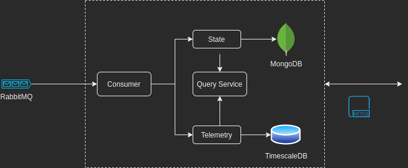

# Janus

## Overview

**Janus** is an ingester services which consumes data coming from a RabbitMQ message queue. Its main purpose is to process all the raw data to be able to clasify it and store it in different databases. It also provides a query service to retrieve the processed information.

## Diagram

## TODO

- Telemetry service
- Query service (gRPC Server)
- Dockerize
- CI/CD
- Docs
